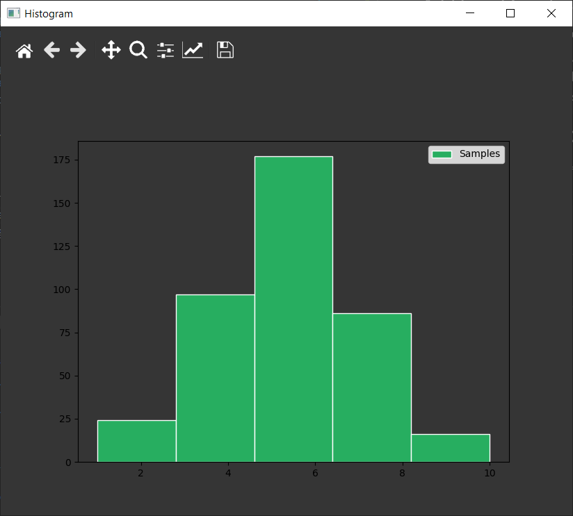

# Simufit Guide

This guide will walk a user through installation, usage of the package and the GUI interface.

## Project Structure
The Simufit project is a Python based application that is designed to produce a whl file for pip package installation. 

Development takes place in an Anaconda virtual environment which is set up for either a Mac, Windows 10 or Linux system. The requirement files used to create the Conda environments the environment_win10.yml and environment.yml file (the latter being used for Linux and Mac). These files are available in the root folder of the application.

The WHL file is built using setup&#46;py, located in the root folder, and it builds the package located in the "simufit" folder. All files related to the execution of Simufit are located in this folder. Please see the architecture diagram provided in the Simufit report for more information about the design of the application.

An azure-pipelines.yml file is included in the root folder for use with the Azure DevOps platform for continuous integration. This YML file instructs the build pipeline to create a new WHL file after every successful Pull Request completion.

A "tests" folder is included which contins the Tests class with a unique test for each distribution type. These tests are run to determine the accuracy of identifying the supported distributions from a randomized dataset. Results of these test can be found in the project report documentation.

## Creating the Conda Environment
To create the Conda Environment, select the appropriate file for the operating system being used (environment_win10.yml for Windows 10, environment.yml for Mac/Linux) then execute the following commands from an Anaconda Prompt.

```
cd <path/to/project>
conda env create --file <filename>
```

### Activating the Conda Environment
```
conda activate sim
```

## Creating a Pip Package:
### Creating the Requirements.txt File
```
pip wheel -r .\simufit\requirements.txt
```
### Creating the WHL file
```
python setup.py bdist_wheel
```

## Installation
One WHL file is used for all supported operating systems Mac, Windows 10, Linux. This file is generated after each Pull Request completion as part of the Azure DevOps continuous integration process. Since this file is not loaded onto a PyPi server at this time, it can be installed from a local folder using Pip. (Please note it is recommended you install this in a prompt using administrator rights.)

```
pip install simufit-0.0.45-py3-none-any.whl
```
The installation will take some time down download and install all components. Since this is using a Conda environment it may be necessary to install Pip to the environment first.

```
conda install pip
```

## Simufit Instructions:
This section will describe the useage of the Simufit package. First it will show how to import the package and any subcomponents, provide a walk-through of loading data and identifying a distribution, and use on how to interface with the GUI for a deeper hands on approach to exploring the dataset.
### Import the Simufit Package:
To use the software there are 3 imports that will help every user out. 
```
import simufit as sf
from simufit import DistributionType as dt
from simufit import Display as dp
```
The first line shows the simufit package being loaded with a common alias of 'sf'. 

DistributionType is an Enum class that provides a collection of supported distributions.

Display is a class that provides access to the GUI directly for a completely hands on experience. 

### Create an instance of the Distribution class
```
x = sf.Distribution()
```

### Setting an Explicit Distribution
```
x.setDistribution(dt.UNIFORM)
```

### Setting a Random Distribution
This will select a random distribution from the DistributionType Enum, exlcuding 'Unknown'.
```
x.setRandomDistribution()
```

### Available Distributions
The 'Unknown' distribution is set by default to denote a set of observation that have yet to be identified or a new Distribution object. Not all methods can be executed directly on the "Unknown" distribution such as the MLE and GOF methods, instead the 'identifyDistribution' method must be used.
``` 
dt.GEOMETRIC
dt.UNIFORM
dt.NORMAL
dt.EXPONENTIAL
dt.GAMMA
dt.BERNOULLI
dt.BINOMIAL
dt.WEIBULL
dt.UNKNOWN
```
### Generate Sample Data
The 'generateSamples' method takes in a **kwargs argument designed to pass all required parameters to the distributions expressed in the dist_generator.py file. These distributions are not designed to be directly accessed, rather they are designed to be used within an instantiated Distribution object. All missing parameter errors provided by these classes will be returned in the same fashion as directly working with them.

Each distribution has parameters specific to that statistical distribution along with the parameters 'size' and 'seed'. Executing the 'generateSamples' method without passing any parameters causes it to randomly select a distribution, then create random values for the parameters and size. 

Distributions loaded, or randomly generated, will populate attributes of the Distribution object such as the size of the dataset, any seed if provided, the range of values, and when the distribution is not 'Unknown' it also will also add the measure type (e.g. Discrete, Continuous).

The following are examples of how to generate samples for each distribution type.
```
x = sf.Distribution()

# 200 Random Samples with Seed
x.generateSamples(size=200, seed=12345)

# Bernoulli
x.setDistribution(dt.BERNOULLI)
x.generateSamples(p=0.5,size=200,seed=12345)

# Binomial
x.setDistribution(dt.BINOMIAL)
x.generateSamples(n=10,p=0.5,size=200,seed=12345)

# Geometric
x.setDistribution(dt.GEOMETRIC)
x.generateSamples(p=0.5,size=200,seed=12345)

# Uniform
x.setDistribution(dt.UNIFORM)
x.generateSamples(a=1,b=10,size=200,seed=12345)

# Normal
x.setDistribution(dt.NORMAL)
x.generateSamples(mean=0,var=1,size=200,seed=12345)

# Exponential
x.setDistribution(dt.EXPONENTIAL)
x.generateSamples(lambd=1,size=200,seed=12345)

# Gamma
x.setDistribution(dt.GAMMA)
x.generateSamples(a=1,b=2,size=200,seed=12345)

# Weibull
x.setDistribution(dt.WEIBULL)
x.generateSamples(a=3,b=10,size=200,seed=12345)

```

### Display Distribution Object Information
```
The 'display' method provides all of the relavent information about the loaded dataset. If a seed is provided it will be shown instead of 'None'. The range of values is provided along with the size of the dataset. A partial list of samples (head/tail). If the distribution has been set or is identified it will show the 'Measure Type' and 'Distribution' of the observations.

x.display()
..........
Seed:  None
Range:  -3.886485561330249 - 3.5320721007053124
Size:  10001
Samples:  [ 0.          0.01208081  1.40534153 ...  0.93437205 -0.92969817
  1.42402297]
Measure Type:  CONTINUOUS
Distribution:  NORMAL
..........
```
### Identify an Unknown Distribution
To run multiple tests (i.e. MLE, GOF, etc..) for identification of a distribution, use the 'identifyDistribution' method. This method will run with 0 parameters or with initial guess parameters specific to different distributions. Though no parameters are required for most distributions, the Binomial does require the 'n' paramter for the number of bins to execute. The 'identifyDistribution' method will evaluate the loaded dataset against all supported distributions in the system. 

Any warnings encountered will be presented for that distribution type. The final output will indicate the distribution identified, or note that one could not be identified but instead will provide the most likely distribution. (The testing class considers these a fail)
```
# Default, no parameters (Skips Binomial)
x.identifyDistribution()

# Run Binomial
x.identifyDistribution(n=5)

# Specify starting parameters for identification
x.identifyDistribution(a0=9,b0=27, use_minimizer=True,p0=0.5,mean0=17.5,var0=4,n=1)

Evaluating Geometric
-----------------------------------------------
Starting...
Completed
-----------------------------------------------

Evaluating Uniform
-----------------------------------------------
Starting...
Completed
-----------------------------------------------

Evaluating Normal
-----------------------------------------------
Starting...
Completed
-----------------------------------------------

Evaluating Exponential
-----------------------------------------------
Starting...
Completed
-----------------------------------------------

Evaluating Gamma
-----------------------------------------------
Starting...
<path\to\folder>\Simulation\simufit\Helpers.py:11: RuntimeWarning: divide by zero encountered in log
  s = np.log((1 / n) * np.sum(samples)) - (1 / n) * np.sum(np.log(samples))
<path\to\folder>\Simulation\simufit\Helpers.py:11: RuntimeWarning: invalid value encountered in log
  s = np.log((1 / n) * np.sum(samples)) - (1 / n) * np.sum(np.log(samples))
Converged in 1 iterations.
Completed
-----------------------------------------------

Evaluating Bernoulli
-----------------------------------------------
Starting...
Completed
-----------------------------------------------

Evaluating Binomial
-----------------------------------------------
Distribution Skipped
-----------------------------------------------

Evaluating Weibull
-----------------------------------------------
Starting...
<path\to\folder>\Simulation\simufit\Helpers.py:37: RuntimeWarning: divide by zero encountered in log
  A = np.sum(np.log(samples)) / n
<path\to\folder>\Simulation\simufit\Helpers.py:37: RuntimeWarning: invalid value encountered in log
  A = np.sum(np.log(samples)) / n
<path\to\folder>\Simulation\simufit\Helpers.py:42: RuntimeWarning: divide by zero encountered in log
  a_hat = (((6 / (np.pi ** 2)) * (np.sum(np.log(samples) ** 2) - ((np.sum(np.log(samples))) ** 2) / n)) / (n - 1)) ** -0.5
<path\to\folder>\Simulation\simufit\Helpers.py:42: RuntimeWarning: invalid value encountered in log
  a_hat = (((6 / (np.pi ** 2)) * (np.sum(np.log(samples) ** 2) - ((np.sum(np.log(samples))) ** 2) / n)) / (n - 1)) ** -0.5
<path\to\folder>\Simulation\simufit\Helpers.py:39: RuntimeWarning: divide by zero encountered in log
  C = lambda x: np.sum((samples ** x) * np.log(samples))
<path\to\folder>\Simulation\simufit\Helpers.py:39: RuntimeWarning: invalid value encountered in log
  C = lambda x: np.sum((samples ** x) * np.log(samples))
<path\to\folder>\Simulation\simufit\Helpers.py:40: RuntimeWarning: divide by zero encountered in log
  H = lambda x: np.sum((samples ** x) * (np.log(samples) ** 2))
<path\to\folder>\Simulation\simufit\Helpers.py:40: RuntimeWarning: invalid value encountered in log
  H = lambda x: np.sum((samples ** x) * (np.log(samples) ** 2))
Converged in 1 iterations.
Completed
-----------------------------------------------

Distribution:  Normal
```
### Displaying an Evaluation Report
To display the values calculated by each of the identification of Distribution tests, use the printReport() method. This provides information gathered during the evaluation such as the measure type detected (e.g. Discrete or Continuous), the number of unique elements (used to identify Bernoulli distributions), and information pertaining the MLE and GOF results of each distribution type. 'Type Detection Match' indicates that the measure type was the same for both the distribution being evaluated and the dataset.

A score is calculated using the Goodness of Fit results relative to the distance from the probability parameter. Please see the project documentation for more information. All distributions are shown in order from most likely to least likely.

If 'identifyDistribution' was able to identify the distribution type, it will automatically update the Distribution object.

```
x.printReport()

EVALUATION REPORT:

Type Detected:  CONTINUOUS
Unique Elements:  10001
=============
Distribution:  Normal
Distribution Type:  CONTINUOUS
Type Detection Match:  True
MLE:  [0.00471985 1.00239414]
Goodness of Fit:  [54.60642229 65.1707689 ]
Goodness of Fit Pass:  True
Overall Score:  1.1759808100466607
-------------
Distribution:  Uniform
Distribution Type:  CONTINUOUS
Type Detection Match:  True
MLE:  [-3.88648556  3.5320721 ]
Goodness of Fit:  [10843.08469153    74.46832416]
Goodness of Fit Pass:  False
Overall Score:  1.578051708155909e-63
-------------
Distribution:  Geometric
Distribution Type:  CONTINUOUS
Type Detection Match:  False
MLE:  [211.87134087]
Goodness of Fit:  [       nan 5.99146455]
Goodness of Fit Pass:  False
Overall Score:  nan
-------------
Distribution:  Exponential
Distribution Type:  CONTINUOUS
Type Detection Match:  True
MLE:  [211.87134087]
Goodness of Fit:  [None None]
Goodness of Fit Pass:  False
Overall Score:  nan
-------------
Distribution:  Gamma
Distribution Type:  CONTINUOUS
Type Detection Match:  True
MLE:  [nan nan]
Goodness of Fit:  [        nan 74.46832416]
Goodness of Fit Pass:  False
Overall Score:  nan
-------------
Distribution:  Binomial
Distribution Type:  CONTINUOUS
Type Detection Match:  False
MLE:  Not Performed
Goodness of Fit:  Not Performed
Goodness of Fit Pass:  False
Overall Score:  nan
-------------
Distribution:  Weibull
Distribution Type:  CONTINUOUS
Type Detection Match:  True
MLE:  [nan nan]
Goodness of Fit:  [        nan 74.46832416]
Goodness of Fit Pass:  False
Overall Score:  nan
-------------
Distribution:  Bernoulli
Distribution Type:  CONTINUOUS
Type Detection Match:  False
MLE:  [0.00471985]
Goodness of Fit:  No GOF for Bernoulli
Goodness of Fit Pass:  False
Overall Score:  nan
-------------

```
### Fit the Data and Get the MLE and GOF:
An alternative to using 'identifydistribution' is to get retrieve the values using the GUI. To do this the user needs to load the dataset using the 'fit' method.
```
x.fit()
```
A window will open that has a dropdown to select various distributions. In this example, it is seen that the Normal distribution is selected, and the parameters 'mean' and 'variance' have sliders. These can be adjusted until the blue line appears to match the observations. 


A second option is to click "Auto Fit" and allow the curve to best match the samples. If this is acceptable, the user click 'Accept Distribution' and the Distribution object will be updated accordingly. The 'mean' and 'variance' values that are shown in the GUI can be used to calcuate the Goodness of Fit (GOF). 


Once the distribution type is identified, or if the user know what the distribution should be and assigned it to the Distribution object, they can execute the MLE command for that specific distribution and give a starting point to calculate it.

#### Calculating the MLE
Though it is recommended the user use the 'identifyDistribution' method, the direct approach of identifying the MLE independently is available. The calls differ with each distribution.
```
# Bernoulli
x.Distribution.MLE(x.getSamples(), use_minimizer=False, p0=None)

# Binomial
x.Distribution.MLE(x.getSamples(), use_minimizer=True, n=None, p0=None)

# Geometric
x.Distribution.MLE(x.getSamples(), use_minimizer=False, p0=None)

# Uniform
x.Distribution.MLE(x.getSamples())

# Normal
x.Distribution.MLE(x.getSamples(), use_minimizer=False, mean0=None, var0=None)

# Exponential
x.Distribution.MLE(x.getSamples(), use_minimizer=False, lambd0=None)

# Gamma
x.Distribution.MLE(x.getSamples(), use_minimizer=False, a0=None, b0=None)

#Weibull
x.Distribution.MLE(x.getSamples(), use_minimizer=False, a0=None, b0=None)
```

#### Calculating the GOF
Similiar to the MLE it is recommended the user use the 'identifyDistribution' method for the Goodness of Fit (GOF) test, but the direct approach of identifying the GOF independently is available. The calls differ with each distribution.
```
# Bernoulli
# Not Applicable for this Distribution

# Binomial
x.Distribution.GOF(x.getSamples(), n=None, mle_p=None)

# Geometric
x.Distribution.GOF(x.getSamples(), mle_p=None)

# Uniform
x.Distribution.GOF(x.getSamples(), mle_a=None, mle_b=None)

# Normal
x.Distribution.GOF(x.getSamples(), mle_mu=None, mle_var=None))

# Exponential
x.Distribution.GOF(x.getSamples(), mle_lambda=None)

# Gamma
x.Distribution.GOF(x.getSamples(), mle_a=None, mle_b=None)

#Weibull
x.Distribution.GOF(x.getSamples(), mle_a=None, mle_b=None)
```

## Example of Loading Data from CSV
Data can be loaded using either the CLI or GUI.

### GUI CSV Loading
The GUI has the ability to load data directly into the plot for evaluation, but to store the data in a Distribution object for any additional evaluation (e.g. identifyDistribution) a Distribution object must be passed in or the GUI must be called on that object.
```
import simufit as sf
from simufit import Display as dp

x = sf.Distribution()
run_fitter(distribution=x)
```
Once the GUI is loaded:

- In the file menu, click Import data
- Click Browse... button and select <filename>.csv


- Select the settings for the file
  - Use Comma Delimiter, semi-colon, tab
  - Skip Rows
  - Use Columnn
- Click import, plot will  load.
- The Distribution object will now be populated with the observed data.


### CLI CSV Loading
A collection of observations can be loaded directly into a Distribution object using an instantiation of it.

```
x = sf.Distribution()
x.readCsv(<filepath>, skip_header=True, delimiter=',')
```

## General Functions
The following general methods can be executed on any Distribution object.

### Reset Object
The reset method clears out all settings and returns it to the state of a new Distribution object.
```
x = sf.Distribution()
x.generateSamples()
x.reset()
```

### Get/Set Seed:
These methods retrieve and establish the seed value for random variate generation.
```
x = sf.Distribution()
x.setSeed(seed=123)
x.getSeed()
```

### Get/Set Size:
These methods retrieve and establish the size for a collection of random variates generated, please note if there are already samples in the Distribution object the size is not mutable.
```
x = sf.Distribution()
x.setSize(size=200)
y.getSize()
```

### Get Range
This method retrieves the minimum and maximum values of the sample observations.
```
x = sf.Distribution()
x.generateSamples()
x.getRange()
```

### General Statistical Methods
The following methods provide general statisical inforamtion about the loaded observations.

```
x = sf.Distribution()
x.generateSamples()

# Median
x.getMedian()

# Expected Value
x.getExpectedValue()

# Variance
x.getVariance()

# Standard Deviation
x.getStandardDeviation()
```
## Additional Graphical Options

### Histogram (w/Comparison)
A user can optionally view just the histogram of a given observation set. By default bins are automatically selected, but the parameter 'bins' can be passed in to specify the bin size.

```
y = sf.Distribution()
y.generateSamples()
y.drawHistogram(bins=5)

```


Alternatively, a user can load a second Distribution object to compare 2 histograms. One idea is that a user could load the observation dataset into 'x' and then generate a specific distribution of random variates and compare the two.

```
x = sf.Distribution()
x.readCsv('<path/to/file>', usecols=1) 
#Usecols allows  data to be loaded from a specific column

y = sf.Distribution()
y.setDistribution(dt.NORMAL)
y.setSize(x.getSize())
y.generateSamples(mean=x.getExpectedValue(),var=x.getVariance())
x.drawHistogram(comparison_distribution=y)
```


## Methods Not Implemented - Next Steps
Future work will include the implementation of even more graphical options to help with distribution identification. These methods exist in the system but will throw exceptions until work is performed in the future. These would be released before a formal 1.0, but remain outside of the scope of this project.

```
x.drawScatterPlot()

x.drawLinePlot()

x.drawBoxPlot()

x.drawDistributionFunctionDifferences()

x.drawQQPlot()

x.drawPPPlot()
```

In addition to these future graphical enhancements, additional statistical methods will be added to support sample evaluation. Please note, these were also stretch goal items beyond the scope of the project and will return an exception if used at this time.

```
x.getCoefficientOfVariation()

x.getLexisRatio()
```

# Known Issues and Troubleshooting
## Loading GUI Does not Appear
### Issue
When running the command dp.run_fitter() or x.fit() the terminal appears to be working on something, but the GUI does not appear. 

### Resolution
The application does load the GUI, but on some operating systems the window does not appear on top of all other windows. Check the other open windows on the system to see if it is hiding behind them.

<hr>

## GUI Blocks Use of Command Line
### Issue
I cannot use the command line while the GUI is open.

### Resolution
This is expected as the Python application is hosting the GUI application. You will not be able to type any commands in the terminal until the GUI has been closed.

<hr>

## Data Missing when GUI Closed
### Issue
I loaded data into the GUI from a CSV/Text file, but when I close the window the data is no longer accessible.

### Resolution
The dp.run_fitter method by default does not import data to a Distribution for use outside of the GUI. To pass data into a Distribution object one must either be passed into the 'run_fitter' method or the 'fit' method must be called inside of an existing Distribution object.

```
x = sf.Distibution()

dp.run_fitter(distribution=x)
# or
x.fit()
```

When the data is imported, or a distribution is accepted, it will then be assigned to the instantiated Distribution object (e.g. x) and the data can be accessed after closing the GUI.

<hr>

## GUI Crashes when Clicking Auto Fit or Accept Distribution

### Issue
When clicking either the 'Auto Fit' or 'Accept Distribution' button crashes the GUI.

### Resolution
This is caused by the use of these buttons when there is not a sample set loaded. Loading a dataset either by passing in a Distribution object, or by reading a CSV will correct this problem.